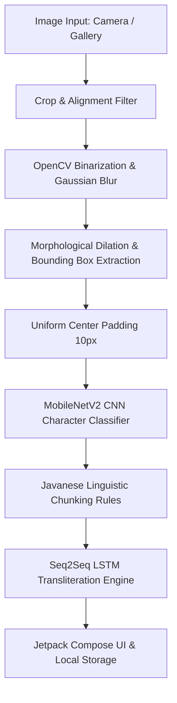

# My Aksoro - On-Device Javanese Script Transliteration Engine

[](https://www.android.com/)
[](https://kotlinlang.org/)
[](https://developer.android.com/jetpack/compose)
[](https://pytorch.org/mobile/home/)
[](https://opencv.org/)
[](LICENSE)

**My Aksoro** is an end-to-end, on-device Android application designed to perform Optical Character Recognition (OCR) and transliteration of Javanese script (*Aksara Jawa*) into Latin text. 

Developed as an academic research project at **Universitas Pembangunan Jaya**, the system preserves indigenous cultural heritage by deploying a hybrid computer vision and deep learning pipeline directly on mobile devices without requiring cloud dependencies or active internet connection.

---

## Key Features

- **100% On-Device & Offline Processing:** Runs local inference using OpenCV C++ SDK and PyTorch Mobile Lite (`.ptl`) for complete privacy and zero latency.
- **Integrated Image Cropper & Camera Engine:** Built-in alignment guidelines for real-time camera capture and gallery uploads (`android-image-cropper`).
- **Hybrid Deep Learning Pipeline:**
  - **OpenCV Engine:** Noise reduction, OTSU threshold binarization, morphological dilation, and uniform center-padded contour segmentation.
  - **MobileNetV2 CNN:** Lightweight, highly optimized Convolutional Neural Network for single-character recognition.
  - **Seq2Seq LSTM:** Sequence-to-sequence model for context-aware Javanese-to-Latin transliteration.
- **Precision Analytics & Visual Debugging:** Displays real-time confidence precision percentages, bounding box visualizations, character detection chips, and linguistic reading chunks.
- **Persistent History Management:** Automatically saves past transliteration results with image caches, timestamps, and confidence metrics locally (`SharedPreferences`).
- **Adaptive Material 3 Theme:** Full support for Light and Dark modes with responsive UI layouts and horizontal scrolling carousels.

---

## System Architecture & Processing Pipeline



1. **Preprocessing & Segmentation (OpenCV):**
   - Grayscale conversion, Gaussian Noise Reduction ($5 \times 5$ kernel), and OTSU Inverse Binary Thresholding.
   - Morphological dilation ($3 \times 10$ rectangular kernel) to merge connected script elements.
   - Contour extraction and bounding box segmentation.
   - **Uniform Center Padding:** Applies a 10-pixel symmetric white padding (`ARGB_8888`) around extracted glyphs. This prevents data leakage previously caused by contextual padding and eliminates alpha-channel tensor bugs.
2. **Character Classification (MobileNetV2):**
   - Resizes glyphs to $224 \times 224$ pixels, normalizes color matrices ($\mu = [0.485, 0.456, 0.406]$, $\sigma = [0.229, 0.224, 0.225]$).
   - Softmax calculation with confidence thresholding ($\ge 0.20$).
3. **Linguistic Chunking & Transliteration (Seq2Seq LSTM):**
   - Applies Javanese linguistic rules (*Nglegena*, *Pasangan*, *Sandhangan*) to chunk character tokens.
   - Dynamic sequence decoding prevents sentence truncation prior to the End-of-Sequence (`<eos>`) token.

---

## Installation & Setup Guide

Follow this step-by-step guide to set up, build, and run the project without errors.

### Prerequisites

Before you begin, ensure your development machine has the following installed:

1. **Android Studio:** Android Studio Ladybug (2024.2.1+) or newer.
2. **JDK:** Java Development Kit 17 (JDK 17) configured in Android Studio (`Settings -> Build, Execution, Deployment -> Build Tools -> Gradle`).
3. **Android SDK:**
   - **Compile SDK:** 34 / 35
   - **Target SDK:** 34 / 35
   - **Min SDK:** 24 (Android 7.0 Nougat)
4. **Android NDK & CMake:** NDK (`r25c` or newer) installed via Android Studio SDK Manager (`Tools -> SDK Manager -> SDK Tools -> NDK (Side by side)` & `CMake`).

---

### Step-by-Step Setup

#### Step 1: Clone the Repository
Open your terminal or command prompt and clone the project:
```bash
git clone https://github.com/dikaarnnd/myaksoro.git
cd myaksoro
```

#### Step 2: Verify AI Model Asset Files
Ensure the two PyTorch Mobile Lite (`.ptl`) model files exist in the `app/src/main/assets/` directory:
```text
app/src/main/assets/
├── mobilenetv2_aksoro_final.ptl
└── seq2seq_aksoro_final.ptl
```
*(If missing, download the pre-trained weights from the repository releases and place them into `app/src/main/assets/`).*

#### Step 3: Open Project in Android Studio
1. Launch **Android Studio**.
2. Click **Open** and select the root directory `myaksoro`.
3. Allow Android Studio to automatically detect and import the Gradle structure.

#### Step 4: Sync Gradle Project
1. In Android Studio, click **File -> Sync Project with Gradle Files** (or click the elephant icon in the top-right toolbar).
2. Wait for Gradle to download dependencies and configure the `:app` and `:opencv` modules.

#### Step 5: Run the Project
1. Connect a physical Android device via USB (with **USB Debugging** enabled) OR launch an Android Virtual Device (AVD Emulator with API 26+).
2. Select the `:app` configuration in the top toolbar.
3. Click **Run 'app'** (Green Play button) or press `Shift + F10`.

---

## Troubleshooting Common Build Errors

### 1. JNI C++ Shared Library Conflict (`libc++_shared.so`)
**Symptom:** Gradle build fails with duplicate `libc++_shared.so` files from PyTorch and OpenCV.  
**Solution:** The project's `app/build.gradle.kts` handles this automatically using:
```kotlin
android {
    packaging {
        resources {
            pickFirsts.add("**/libc++_shared.so")
        }
    }
}
```

### 2. Emulator ABI Filter Mismatch
**Symptom:** UnsatisfiedLinkError when running on x86_64 AVD Emulators vs ARM physical devices.  
**Solution:** The `debug` build type is configured without ABI restrictions to support x86_64 emulators, while `release` restricts to `arm64-v8a` and `armeabi-v7a`.

### 3. Out of Memory (OOM) / Heap Exhaustion
**Symptom:** Gradle build times out or fails with Java Heap Space error.  
**Solution:** Ensure `gradle.properties` includes sufficient heap allocation:
```properties
org.gradle.jvmargs=-Xmx4096m -XX:MaxMetaspaceSize=1024m
```

---

## Project Directory Structure

```text
myaksoro/
├── app/                                 # Main Android Application Module
│   ├── build.gradle.kts                # App Dependencies & Build Configurations
│   └── src/
│       ├── main/
│       │   ├── AndroidManifest.xml     # App Permissions & Manifest Declarations
│       │   ├── assets/                 # PyTorch Mobile Lite Models (.ptl)
│       │   │   ├── mobilenetv2_aksoro_final.ptl
│       │   │   └── seq2seq_aksoro_final.ptl
│       │   │
│       │   ├── java/com/dika/myaksoro/
│       │   │   ├── AksoroEngine.kt     # Core Image Processing & AI Inference Engine
│       │   │   ├── MainActivity.kt     # App Entry Point & Scaffold Setup
│       │   │   │
│       │   │   ├── data/               # Data Layer
│       │   │   │   └── HistoryManager.kt # SharedPreferences History Storage & Item Model
│       │   │   │
│       │   │   └── ui/                 # Jetpack Compose UI Layer
│       │   │       ├── components/     # Reusable UI Components
│       │   │       │   ├── AksoroBottomBar.kt
│       │   │       │   ├── AksoroTopBar.kt
│       │   │       │   ├── CaptureCard.kt
│       │   │       │   ├── DeleteHistoryDialog.kt
│       │   │       │   ├── DetectionChips.kt
│       │   │       │   ├── ExpandableSectionHeader.kt
│       │   │       │   ├── HistoryCard.kt
│       │   │       │   ├── ImageSourceButtons.kt
│       │   │       │   ├── ProcessingOverlay.kt
│       │   │       │   ├── ReadingChunkList.kt
│       │   │       │   ├── RecentHistorySection.kt
│       │   │       │   ├── ResultCard.kt
│       │   │       │   ├── ResultStyle.kt
│       │   │       │   ├── SectionLabel.kt
│       │   │       │   ├── TransliterationResultBox.kt
│       │   │       │   ├── TransliterationResultContent.kt
│       │   │       │   └── ZoomableImage.kt
│       │   │       │
│       │   │       ├── navigation/     # Navigation & State Hoisting
│       │   │       │   └── AksoroNavHost.kt
│       │   │       │
│       │   │       ├── screens/        # Screen Views
│       │   │       │   ├── HomeScreen.kt
│       │   │       │   ├── HistoryScreen.kt
│       │   │       │   ├── HistoryToolbar.kt
│       │   │       │   └── SplashScreen.kt
│       │   │       │
│       │   │       └── theme/          # Material 3 Color Schemes & Typography
│       │   │           ├── Color.kt
│       │   │           ├── Theme.kt
│       │   │           └── Type.kt
│       │   │
│       │   └── res/                    # App Drawables, Fonts & Strings
│
├── opencv/                             # OpenCV SDK Native Module
├── gradle/                             # Gradle Wrapper & Version Catalog
├── build.gradle.kts                    # Root Gradle Script
├── settings.gradle.kts                 # Module Inclusions (`:app`, `:opencv`)
└── README.md                           # Project Documentation
```

---

## Machine Learning Model Export Guidelines

For developers looking to retrain or export custom PyTorch models to PyTorch Mobile (`.ptl`):

- **Avoid MobileNetV2 Weight Corruption:**  
  Do not invoke `optimize_for_mobile()` during script conversion. Use direct Lite Interpreter export (`_save_for_lite_interpreter`) on traced models. This preserves `Conv2d` and `BatchNorm` fused layers, maintaining on-device accuracy matching Python test environments.
- **Alphabetical Class Mapping Alignment:**  
  Ensure the Kotlin `classNames` array is strictly sorted alphabetically (A-Z) to match PyTorch `ImageFolder` dataset indexing.
- **Seq2Seq LSTM Scripting:**  
  Use `torch.jit.script` instead of `torch.jit.trace` when exporting the Seq2Seq LSTM model to correctly support dynamic loops in the decoder architecture.


